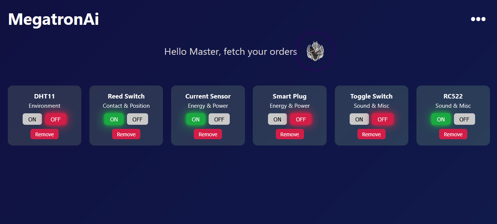
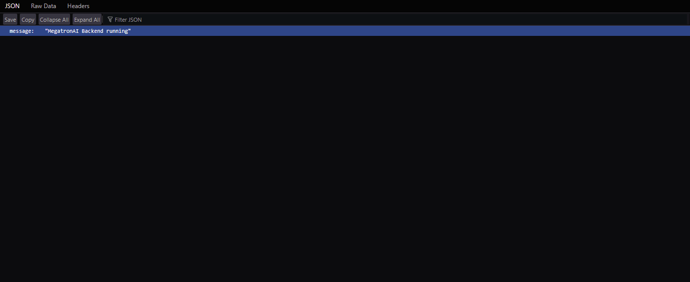

Here’s the **entire finished README.md** in one block — you can copy it exactly as is and paste it into your GitHub editor, then commit:

```markdown
# ⚡ MegatronAI — Smart IoT Dashboard with Voice & AI Control

MegatronAI is a **full-stack IoT platform** that lets you **monitor and control smart devices** (sensors, switches, plugs, etc.) via a modern web dashboard and AI-powered voice/text commands.

The system combines:

- 🌐 **React frontend** — responsive dashboard with animated UI and device control panel.  
- 🚀 **FastAPI backend** — REST API + simple intent parser + MQTT integration.  
- 🔊 **Voice interface** — audio commands (transcribed with [OpenAI Whisper](https://github.com/openai/whisper)) and AI-generated spoken replies (via [gTTS](https://pypi.org/project/gTTS/)).  
- 📡 **MQTT broker** — real-time messaging between the app and your IoT devices.

---

## ✨ Features

- **Beautiful animated dashboard**  
  - Gradient animated background, device status cards, right-side sliding control panel.
- **Device management**  
  - Add, remove, turn ON/OFF supported devices such as DHT11 (temperature/humidity), Reed Switch, PIR motion, RC522 RFID, Smart Plugs, etc.
- **Voice & AI commands**  
  - Speak or type commands like:
    - `Turn on living room light`
    - `Add PIR sensor`
    - `Turn off fan`
  - The backend parses intent and sends MQTT messages automatically.
- **Real-time MQTT control**  
  - Publishes to topics like `megatronai/<category>/<device>` or `megatronai/general/<device>`.
- **Cross-platform** — Works in any browser, built with [Create React App](https://create-react-app.dev/).

---

## 🏗️ Architecture

```

Frontend (React) → REST API (FastAPI) → MQTT Broker → IoT Devices
↑
Whisper + gTTS

````

- **Frontend**: `App.js` renders a top bar, animated background, grid of device cards, and a right drawer to manage devices.  
- **Backend**: `main.py` exposes API endpoints:
  - `GET /` → health check (`{"message": "MegatronAI Backend running"}`)
  - `POST /device/{category}/{device}/{command}` → sends MQTT command.
  - `POST /ask_ai` → simple text intent parser (turn on/off/add sensor).
  - `POST /voice` → transcribes uploaded audio with Whisper, parses intent, publishes MQTT, and returns TTS reply mp3.
- **MQTT**: Default broker `localhost:1883` (edit in `main.py` if needed).  
- **Voice**: Uses [OpenAI Whisper](https://github.com/openai/whisper) (model `base`) for speech-to-text and [gTTS](https://pypi.org/project/gTTS/) for text-to-speech replies.

---

## 🖥️ Frontend Setup

**Requirements:** Node.js ≥ 16

```bash
cd frontend
npm install
npm start
````

* Runs on [http://localhost:3000](http://localhost:3000) by default.
* Main scripts:

  * `npm start` — development mode
  * `npm run build` — production build
  * `npm test` — run tests

Dependencies include **React 19**, `react-icons`, `@testing-library/*`, `ajv` & `ajv-keywords` for JSON schema validation.

---

## ⚙️ Backend Setup

**Requirements:** Python 3.10+
Install dependencies:

```bash
pip install fastapi uvicorn paho-mqtt gTTS openai-whisper
```

Run the FastAPI server:

```bash
uvicorn main:app --reload --host 0.0.0.0 --port 8000
```

Backend will be live at `http://localhost:8000`.

---

### MQTT Broker

You need an MQTT broker (e.g., [Mosquitto](https://mosquitto.org/)) running locally:

```bash
# Ubuntu / Debian
sudo apt install mosquitto
mosquitto -v
```

Default configuration connects to `localhost:1883`.

---

### Voice Commands

1. Frontend uploads `.wav` files to `POST /voice`.
2. Backend transcribes with Whisper (`base` model).
3. Intent parser extracts action & target (e.g., “turn_on light”).
4. MQTT command is sent and an mp3 reply is generated (TTS).

---

## 🗂️ Project Structure

```
frontend/
│  App.js          # React dashboard logic
│  App.css         # Custom animated UI & panel styles
│  index.js        # React entry point
│  index.css       # Base CSS reset & fonts
│  public/
│    index.html    # CRA HTML template
│    favicon.ico   # App icon
│
backend/
│  main.py         # FastAPI app + MQTT + Whisper + gTTS
│
.gitignore         # Ignores node_modules, build, env files, logs
package.json       # Frontend deps & npm scripts
package-lock.json  # Locked versions of deps
README.md          # (this file)
```

---

## 🛠️ Development Notes

* You can extend the **intent parser** in `main.py` to support more natural language commands.
* To change MQTT topics, edit `control_device()` and `handle_intent()` in `main.py`.
* CSS uses **animated gradients** and **backdrop blur** for a modern look.
* Default CRA service worker is not configured; you can enable PWA if needed.

---

## 🚀 Deployment

* **Frontend:**
  Build with `npm run build` and deploy the `/build` folder to Vercel, Netlify, or any static host.
* **Backend:**
  Deploy FastAPI using Docker, Uvicorn + Gunicorn, or platforms like Render/Heroku.
* **MQTT:**
  Use a cloud broker (HiveMQ, EMQX) or self-host Mosquitto.

---

## 📸 Screenshots






---

## 📜 License

MIT — free to use and modify.

```
